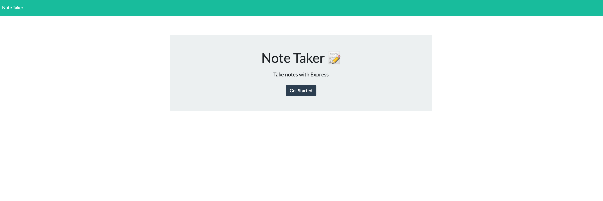
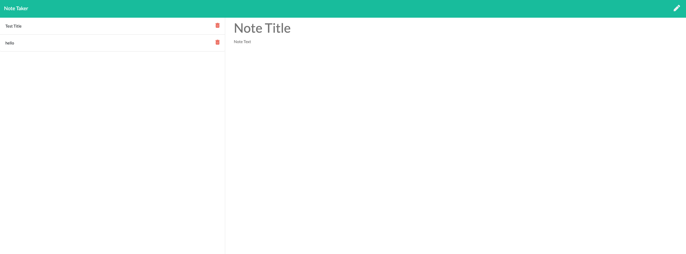

# Note Taker

## Description
This is a note taker that I completed from a starter code. Users will be able to write down new notes and read them later in the future.

## Table of Contents
- [Installation](#installation)
- [Usage](#usage)
- [Credits](#credits)
- [Test](#tests)
- [License](#license)
- [Questions](#questions)

## Installations
Install all dependencies using npm i

## Usage

1. Go to: https://sheltered-caverns-54438.herokuapp.com/
2. Click on 'Get Started' CTA to enter notes.
3. All the saved notes are on the left side of the page.
4. Click on any of the saved notes to read the notes.
5. Click on the pen icon on the top right of the browser to create a new note.
6. Enter note information.
7. Click on the save icon to save notes.
8. Click on the delete button on the saved notes section to delete desired note.

## Credits
N/A

## Tests
N/A

## License
[MIT](https://lbesson.mit-license.org/)

## Questions
If you have questions, please reach out here:
Github: byung90
Email: byung90@gmail.com
